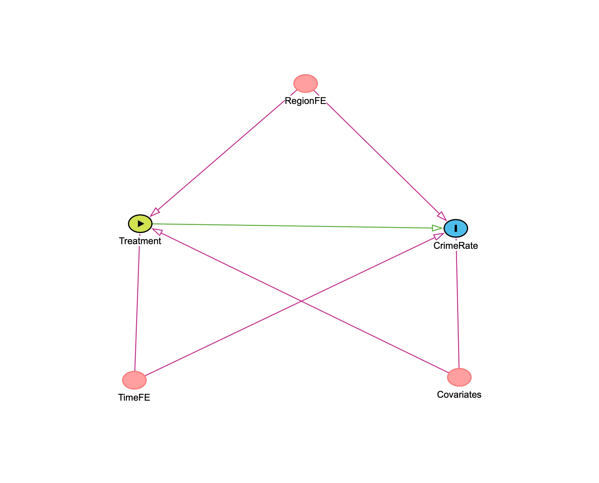

# Refugee Inflow and Crime Rates: A Difference-in-Differences Analysis

This project investigates whether the large inflow of refugees into German federal states around 2015–2016 affected regional crime rates.  
The analysis is based on a clean causal inference framework using **Difference-in-Differences (DiD)** and **Event-Study** models, supported by exploratory plots and a formal causal DAG.


## Research Question

**Did regions that received a higher intensity of refugee inflow experience increase in crime rates after 2015?**

That question is solved using a causal design and DiD workflow

### Why 2015–2016 is the Treatment Period?

The treatment year in this study is defined as **2015–2016**, based on both
institutional events and observed data patterns:

- **2015 marked the peak of the European refugee inflow**, commonly referred to as the “European refugee crisis.”
- In September 2015, Chancellor Angela Merkel announced the *“Wir schaffen das”* policy, effectively opening Germany’s borders to asylum seekers.
- Official Destatis statistics show that **the largest year-to-year increase in the foreign and protection-seeking population occurred between 2015 and 2016**.

Because this period represents a clear, exogenous, and well-documented migration shock,  
it is used as the **treatment timing** for the Difference-in-Differences design.

---

## Motivation

The 2015 refugee inflow was a major demographic and political event in Germany.  
Public debates often claim a link between migration and crime.  
This project provides a data-driven causal assessment using modern econometric tools.

---

## Main Findings

Based on panel data from 16 German regions (2010–2020) and a series of Difference-in-Differences (DiD) specifications, the following conclusions were reached:

---

### 1. Baseline DiD suggests a negative effect, but it is not causal

The simple two-way DiD (without fixed effects) estimates:

- **did = –1599 crimes per 100k population (p < 0.001)**

However, this model does not control for region-specific or year-specific heterogeneity.  
 **It cannot be interpreted causally and serves only as a base benchmark.**

---

### 2. Fully specified model shows no statistically significant effect

After including:

- region fixed effects (`C(region)`)
- year fixed effects (`C(year)`)
- heteroskedasticity-robust **HC3** standard errors the treatment effect becomes:

- **did = –208.96, p = 0.132 -> not significant**

 **There is no robust evidence that refugee inflows increased crime rates.**

---

## 3. All covariates model **fully confirms** baseline DiD findings:

- No dynamic effect of refugee inflows  
- No significant changes in crime trends  
- Results are robust to socio-economic controls 

> Adding unemployment and demographic composition does not alter the conclusion:  
> **the refugee inflow did not causally increase crime rates in German regions.**


---

### 4. Pre-trend test confirms the parallel trends assumption

In the pre-2015 sample (2010–2014), the interaction term:

- **treated × year_num = –64.6, p = 0.288**

**No systematic deviation in pre-treatment trends**, validating the core assumption required for DID identification.

---

### 5. Placebo DID -> no “false” effect

Running DID on pre-treatment years only:

- **fake_did = –276.1, p = 0.093 → not significant**

**The model correctly shows no effect where none should exist**, strengthening confidence in the main specification.

---

### 6. Different threshold 

To test whether results depend on how “treated regions” are defined,  
DID models were re-estimated using **five alternative thresholds** of treatment intensity in 2016:

- 40th percentile (`p40`)
- 60th percentile (`p60`)
- 75th percentile (`p75`)
- Mean
- Median (baseline)

This checks whether treatment assignment is driving the results.

- All p-values are well above 0.1.  
- This means **no version of the DID design finds an impact of refugee inflows on crime**, regardless of how the treated group is defined.

- Some thresholds produce **negative effects**, some **positive**,  
but all are **close to zero relative to the crime rate scale**.

> Final Conclusion of this test

**The median threshold (baseline) is not special**

Its result is **not stronger, not weaker**, and not qualitatively different from others.

This confirms that:

- The main conclusion does **not depend** on the chosen cutoff  
- Treatment assignment is **not artificially creating** the DID effect  
- Results are **robust to threshold choice**

---

### 7. Event-study analysis shows no dynamic causal effect

Event-study coefficients:

- are consistently negative in pre-treatment years but remain **stable over time**, indicating no deviation trends before 2015  
- stay at a similar negative level after 2015, showing **no change in the pattern following the refugee inflow**  
- confidence intervals remain fully below zero, reflecting a **baseline level difference** between treated and control regions  
- reveal **no structural break around the treatment year**

Overall, the event-study pattern supports the DiD findings:  
although treated regions have a lower baseline crime rate, the **trend does not shift after 2015**, implying **no dynamic causal impact** of refugee inflow on crime.

---

## Overall Conclusion

Across all modeling strategies — baseline DID, full two-way FE model, pre-trend check, placebo test, and event-study visualization — **there is no evidence that the 2015 refugee inflow caused an increase in crime rates in German regions.**

The empirical results show:

- parallel trends hold  
- no causal effect is detected  
- placebo tests validate the methodology  
- event-study dynamics remain flat around the treatment year  
- different threshold test shows that there is no artificial effect on did with chosen median split

### ⭐ Final interpretation:

**The 2015 refugee inflow did not lead to higher regional crime rates.**  
Observed variation is explained by region and year fixed effects, not by treatment status.

---

## Limitations

While the analysis is carefully constructed and follows established causal inference practices, several limitations should be acknowledged:

1. **Aggregate-level data (ecological limitations).**  
   The analysis relies on region-level aggregated statistics.  
   Individual-level mechanisms (offender demographics, migrant composition, age structure) cannot be observed.

2. **Parallel trends cannot be proven, only tested.**  
   Although pre-trend tests support the assumption, no statistical test can *prove* parallel trends — it remains an identifying assumption.

3. **Potential unobserved confounders.**  
   Region fixed effects and year fixed effects absorb many sources of heterogeneity,  
   but time-varying regional shocks correlated with refugee inflows could still bias estimates.

4. **No modeling of spillovers across regions.**  
   The DiD design assumes no migration-driven spillovers (e.g., displacement of crime to neighboring states).  
   Spatial effects are not modeled.

5. **Treatment intensity is simplified.**  
   Treatment is based on the change in foreign population, not on:
   - nationality composition,
   - asylum status (approved vs pending),
   - integration measures,
   - settlement policies by municipalities.


6. **Crime data limitations (underreporting).**  
   Police crime statistics (PKS) are influenced by reporting rates, policing practices, and political attention,  
   which can change over time and between regions.

7. **No staggered treatment modeling.**  
   The approach assumes a single treatment timing (2015),  
   while in reality the intensity of asylum inflows varies across months and could be modeled using staggered DID methods.

Despite these limitations, the combination of pre-trend tests, placebo analysis, and event-study dynamics provides strong evidence against a causal link between the 2015 refugee inflow and higher crime rates.

---

## Data

The dataset is a balanced regional panel (2010–2020) containing:

- total crime counts  
- crime rate per 100k population  
- foreigners / refugee counts  
- regional identifiers  
- year  

The analysis constructs:

- **treatment intensity** — yearly change in foreign population  
- **treated vs. control regions** — determined by the **median split** of intensity in 2016  
- **treatment year** — 2015  
- **pre-period** — 2010–2014  
- **post-period** — 2016–2020  

---

## Causal Diagram (DAG)

This DAG represents the assumed causal structure behind the effect of refugee inflows on crime rates.  
It clarifies which backdoor paths must be closed and why region and year fixed effects are required.

<p align="center">
  
</p>

The DAG is also available in:

`figures/dag_model.jpeg`

---

## Methodology

### Difference-in-Differences (Two-Way FE)
Baseline model:

- region fixed effects  
- year fixed effects  
- treatment indicator  
- treatment × post interaction (DID estimator)

### Event-Study Model
Dynamic treatment effects:

- leads & lags relative to 2015  
- reference year = 2015   

### Treatment Construction

**Treated regions** are those where:

Δ foreign_population_2016  > median(Δ foreign_population_2016)


---

## Key Visualizations

All plots are generated in `plots.py`:

- **Treatment intensity distribution**
- **Parallel trends: treated vs control**
- **Event-study coefficients with 95% CI**
- (Optional) raw descriptive plots of crime & population

Example outputs are saved in `figures/`.

---

## Data Sources

The panel dataset (2010–2020) was constructed from multiple official statistical sources:

### **1. Persons Seeking Protection (Refugee inflow)**
German Federal Statistical Office (Destatis)  
🔗 https://www-geneis.destatis.de/datenbank/online/statistic/12531/table/12531-0022

### **2. Foreign Population by State**
German Federal Statistical Office (Destatis)  
🔗 https://www-genesis.destatis.de/datenbank/online/statistic/12521/table/12521-0022

### **3. Police Crime Statistics (PKS)**
Federal Criminal Police Office (Bundeskriminalamt — BKA)  
🔗 https://www.bka.de/DE/AktuelleInformationen/StatistikenLagebilder/PolizeilicheKriminalstatistik/pks_node.html

### **4. Average Annual Population**
German Federal Statistical Office (Destatis)  
🔗 https://www-genesis.destatis.de/datenbank/online/statistic/12411/table/12411-0042

### **5. Registered Unemployment**
German Federal Employment Agency / Destatis  
🔗 https://www-genesis.destatis.de/datenbank/online/statistic/13211/table/13211-0007

*Note:* All variables used in this study rely on **aggregated counts of foreign residents and asylum applicants** as reported by Destatis.  
The analysis does **not differentiate between nationalities**, since the research question concerns the *total inflow* and not country-specific migration patterns.


---

## Methodological References

The causal inference framework used in this project is based on foundational literature:

- **Brady Neal** — *Introduction to Causal Inference*  
- **Judea Pearl** — *The Book of Why*  
- **Judea Pearl** — *Causal Inference in Statistics: A Primer*

These works guided the DAG construction, backdoor-path reasoning, and the application of the Difference-in-Differences methodology.

---

## Project Structure
```
did_project/
│
├── data/
│   ├── raw/               # original panel data (not tracked in git if large)
│   └── processed/         # cleaned panel data (panel_2010_2020.csv)
│
├── figures/               # saved figures (e.g., DAG, trends, event-study)
│   └── dag_model.jpeg
│
├── notebooks/
│   └── 01_did_analysis.ipynb   # main analysis
│
├── src/
│   └── refugees_did/
│       ├── config.py      # project paths & analysis parameters
│       ├── design.py      # treatment assignment & panel preparation
│       ├── models.py      # DiD & event-study model specifications
│       └── plots.py       # visualization utilities
│
├── requirements.txt
└── README.md
└── LICENSE

```

---

## How to Run the Project

### 1. Clone the repository
```bash
git clone https://github.com/foxymadeit/did-refugees-crime.git
cd did-refugees-crime
```

## 2. Install the requirements
`pip install -r requirements.txt`

This project was developed and tested under Python 3.9.6 with:

- pandas 2.2.3
- numpy 2.0.2
- matplotlib 3.9.4
- statsmodels 0.14.5
- notebook 7.5.0

## 3. Launch the analysis notebook
`jupyter notebook notebooks/01_did_analysis.ipynb`


---


Author

Volodymyr Samoilov

e-mail: volodymyr.samoilov@gmail.com

---

## License

This project is released under the MIT License.  
See the `LICENSE` file for details.
